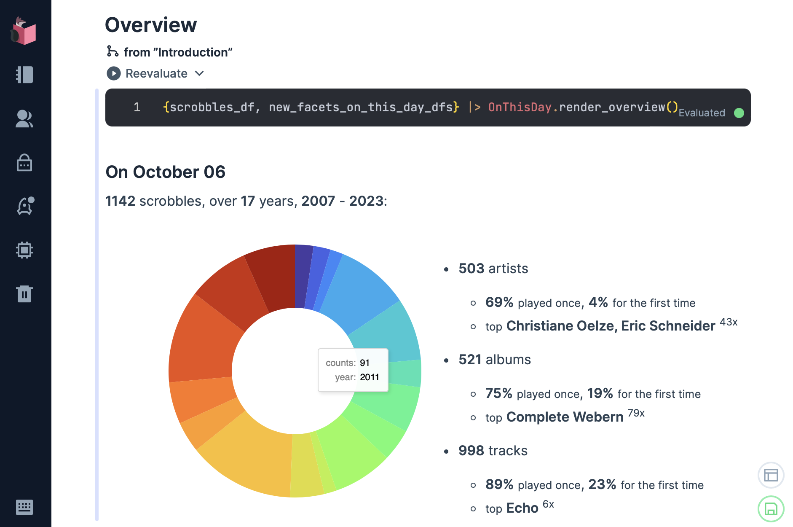
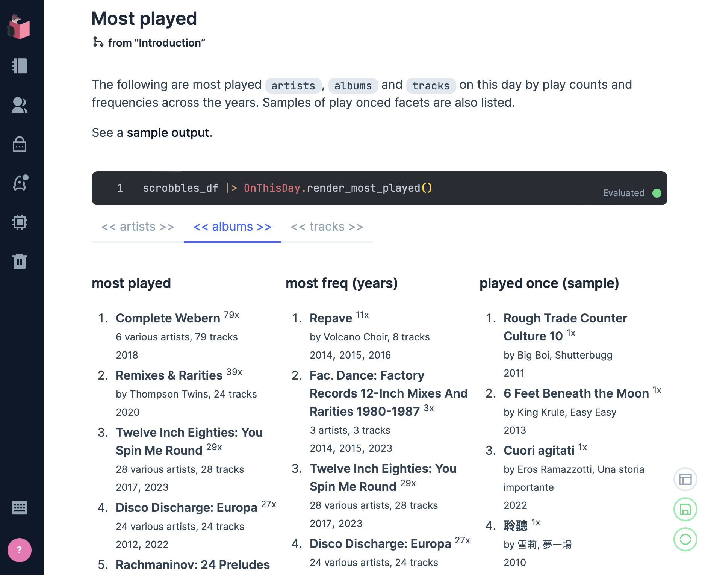
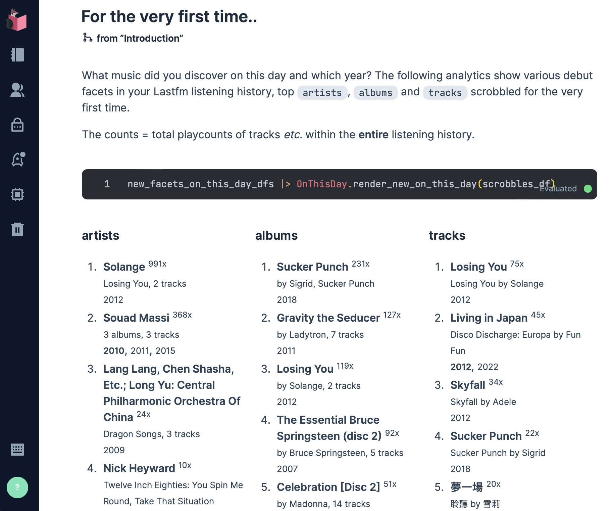

# Coda: music listening history [](https://github.com/boonious/coda/actions/workflows/elixir.yml) [](https://hex.pm/packages/coda)

Analytics and visualisation of Last.fm music listening history 听歌历史.

`coda` currently experimental and works with Last.fm columnar data extracted by
[lastfm_archive](https://github.com/boonious/lastfm_archive). See:
[Creating a file archive](https://github.com/boonious/lastfm_archive#livebook-guides).

See [on this day ♫](#livebook) analytics Livebook.

## Usage
 
For now, you can deploy and use the tool in [Livebook](https://livebook.dev) while
an analytics API and functionality are being refactored and developed.

### Livebook
[On this day ♫](https://hexdocs.pm/coda/on_this_day.html) presents
analytics of music discovered (new) and most played Lastfm scrobbles 
on this day (today) over the years. 
The page also features an interactive [Kino explorer](https://hexdocs.pm/kino_explorer/Kino.Explorer.html)
to help delving into the data.

[](https://livebook.dev/run?url=https%3A%2F%2Fraw.githubusercontent.com%2Fboonious%2Fcoda%2Fmaster%2Flivebook%2Fon_this_day.livemd)








## Requirement

This tool requires Elixir and Erlang (see [installation](https://elixir-lang.org/install.html) details
for various operating systems) or [Livebook](https://livebook.dev).

## Installation

`coda` is [available in Hex](https://hex.pm/packages/coda),
the package can be installed by adding `coda`
to your list of dependencies in `mix.exs`:

```elixir
def deps do
  [
    {:coda, "~> 0.3"}
  ]
end
```

Documentation can be generated with [ExDoc](https://github.com/elixir-lang/ex_doc)
and published on [HexDocs](https://hexdocs.pm). Once published, the docs can
be found at [https://hexdocs.pm/coda](https://hexdocs.pm/coda).

## Configuration
Add the following `lastfm_archive` config in `config/config.exs`:

```elixir
  config :lastfm_archive,
    user: "lastfm_user", # Lastfm user
    data_dir: "./lastfm_data/", # directory containing Lastfm file data,
```

